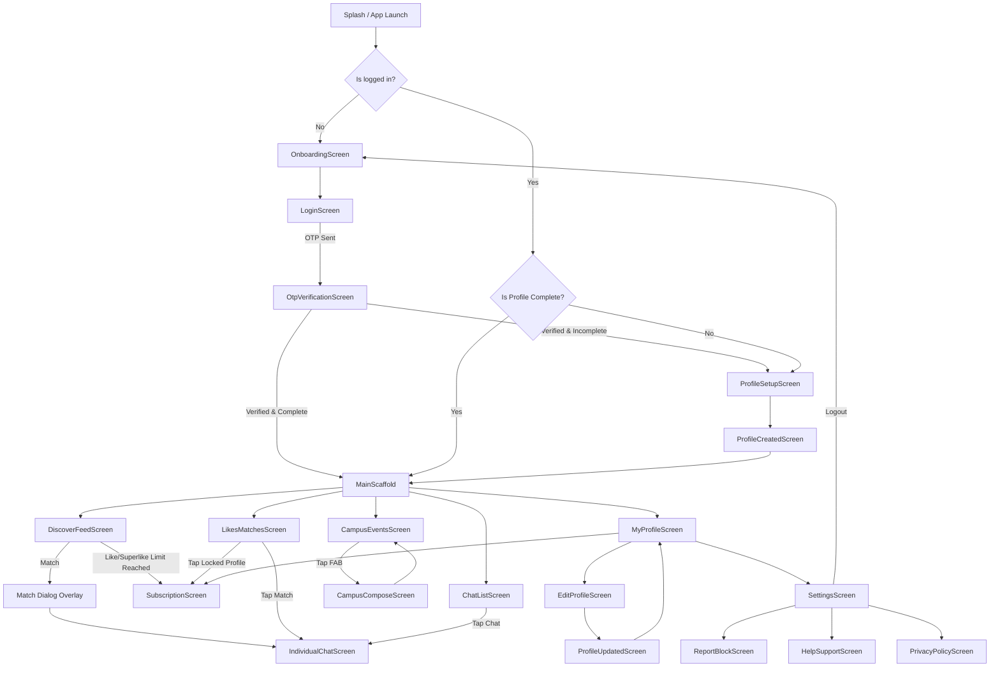

# Navigation Flow & User Journey

This document outlines the complete screen-to-screen navigation flow for the FRND Flutter app. It serves as a reference for developers and QA to understand the user journey, entry/exit points, data inputs, and edge cases.

## Screen Flow Diagram

---

## Detailed Screen Breakdown

### 1. Onboarding
- **Screen Name**: `OnboardingScreen` (`/onboarding`)
- **Entry Points**: 
  - App Launch (if user is not logged in)
  - Settings (after user logs out)
- **User Inputs**: None (Introduction carousels/slides)
- **Exit Points**: 
  - Tap "Get Started" → `LoginScreen`
- **Screen Type**: Full Page

### 2. Login (Auth)
- **Screen Name**: `LoginScreen` (`/login`)
- **Entry Points**: 
  - Tap "Get Started" on Onboarding
- **User Inputs**:
  | Field | Input Type | Required | Validation |
  |-------|------------|----------|------------|
  | College Email | Email Text | Yes | Must not be empty |
  | Password | Password Text | Yes | Must not be empty |
- **Exit Points**: 
  - Success (Needs OTP) → `OtpVerificationScreen`
  - Success (Existing User, Complete Profile) → `MainScaffold`
  - Success (Existing User, Incomplete Profile) → `ProfileSetupScreen`
- **Screen Type**: Full Page

### 3. OTP Verification
- **Screen Name**: `OtpVerificationScreen` (`/otp`)
- **Entry Points**: 
  - Submitting a new/unverified email on `LoginScreen`
- **User Inputs**:
  | Field | Input Type | Required | Validation |
  |-------|------------|----------|------------|
  | OTP Code | 6-digit PIN | Yes | Numeric, exact length |
- **Exit Points**: 
  - Success (Incomplete Profile) → `ProfileSetupScreen`
  - Success (Complete Profile) → `MainScaffold`
- **Screen Type**: Full Page

### 4. Profile Setup
- **Screen Name**: `ProfileSetupScreen` (`/setup`)
- **Entry Points**: 
  - Successful OTP Verification (for new users)
  - App launch (if logged in but profile incomplete)
- **User Inputs**:
  | Field | Input Type | Required | Validation |
  |-------|------------|----------|------------|
  | Username | Text | Yes | Not empty |
  | Name | Text | Yes | Not empty |
  | Age | Number | Yes | Not empty, Numeric |
  | Gender | Selection | Yes | Must pick one (Male/Female/Non-Binary) |
  | Bio | Multi-line Text | Yes | Not empty |
  | School & Course | Text | Yes | Not empty |
  | Height, Religion, Beliefs | Text/Number | Yes | Not empty |
  | Photos | Image Picker | Yes | At least 1 photo |
  | Interests | Multi-select | Yes | Between 5 and 10 |
  | Prompts | Text | Yes | Exactly 3 prompt answers |
  | Preferences (Gender, Looking For) | Selection | Yes | Must pick preferences |
- **Exit Points**: 
  - Finish Setup → `ProfileCreatedScreen` (which auto-redirects to `MainScaffold`)
- **Screen Type**: Full Page (multi-step form via PageView)

### 5. Main Scaffold
- **Screen Name**: `MainScaffold` (`/main`)
- **Entry Points**: 
  - Successful Login / OTP / Profile Setup
- **User Inputs**: Bottom Navigation Bar taps
- **Exit Points**: Switches between Discover, Matches, Campus, Chats, and Profile tabs.
- **Screen Type**: Full Page Container (IndexedStack)

### 6. Discover Feed
- **Screen Name**: `DiscoverFeedScreen` (Tab 0)
- **Entry Points**: Default tab on `MainScaffold`
- **User Inputs**: Swipe gestures (Left = Pass, Right = Like, Up = Superlike)
- **Exit Points**: 
  - Hit Quota Limit → `SubscriptionScreen` (Paywall Dialog)
  - Form Match → Match Overlay Dialog
- **Screen Type**: Tab View / Full Page

### 7. Match Overlay
- **Screen Name**: `_showMatchDialog` (method in Discover)
- **Entry Points**: Swiping Right/Up and getting a match response from API
- **User Inputs**: None
- **Exit Points**: 
  - Tap "Say Hi" → `IndividualChatScreen`
  - Tap outside / Close → Back to Discover Feed
- **Screen Type**: Dialog Overlay

### 8. Likes & Matches
- **Screen Name**: `LikesMatchesScreen` (Tab 1)
- **Entry Points**: Bottom Nav tap
- **User Inputs**: Tap on a profile card
- **Exit Points**: 
  - Tap Match → `IndividualChatScreen`
  - Tap Locked Profile (Free Tier) → Paywall Dialog (`SubscriptionScreen`)
  - Tap Unlocked Profile (Silver/Gold) → Full Profile Sheet
- **Screen Type**: Tab View

### 9. Campus Feed
- **Screen Name**: `CampusEventsScreen` (Tab 2)
- **Entry Points**: Bottom Nav tap
- **User Inputs**: Scroll feed, toggle tabs (Latest, Trending)
- **Exit Points**: 
  - Tap "+" FAB → `CampusComposeScreen`
- **Screen Type**: Tab View

### 10. Campus Compose
- **Screen Name**: `CampusComposeScreen`
- **Entry Points**: Tap FAB in Campus Events
- **User Inputs**:
  | Field | Input Type | Required | Validation |
  |-------|------------|----------|------------|
  | Whisper Text | Multi-line Text | Yes | Max words based on tier (250/400/900) |
- **Exit Points**: 
  - Submit / Close → `CampusEventsScreen`
- **Screen Type**: Full Page (Pushed Route)

### 11. Chat List
- **Screen Name**: `ChatListScreen` (Tab 3)
- **Entry Points**: Bottom Nav tap
- **User Inputs**: Tap a conversation
- **Exit Points**: 
  - Tap Chat → `IndividualChatScreen`
- **Screen Type**: Tab View

### 12. Individual Chat
- **Screen Name**: `IndividualChatScreen`
- **Entry Points**: Chat List, Match Dialog, Likes Screen
- **User Inputs**: 
  | Field | Input Type | Required | Validation |
  |-------|------------|----------|------------|
  | Message | Text | Yes | Not empty |
- **Exit Points**: 
  - Tap Back → Previous Screen
- **Screen Type**: Full Page (Pushed Route)

### 13. My Profile
- **Screen Name**: `MyProfileScreen` (Tab 4)
- **Entry Points**: Bottom Nav tap
- **User Inputs**: Buttons
- **Exit Points**: 
  - Tap Edit → `EditProfileScreen`
  - Tap Settings → `SettingsScreen`
  - Tap Upgrade Tier → `SubscriptionScreen`
- **Screen Type**: Tab View

### 14. Subscription / Paywall
- **Screen Name**: `SubscriptionScreen` (`/subscription`)
- **Entry Points**: 
  - Profile Screen "Upgrade" button
  - Discover Feed (Quota limit reached)
  - Likes Screen (Tapping locked free-tier profile)
- **User Inputs**: Select Tier (Silver/Gold)
- **Exit Points**: 
  - Razorpay Checkout Modal
  - Back → Previous Screen
- **Screen Type**: Full Page (Pushed Route) or Dialog wrapper

---

## Edge Cases & Alternate Flows

1. **Incomplete Profile Blocking**:
   - If a user closes the app during `ProfileSetupScreen`, the next app launch checks `AuthService.isProfileComplete`. If false, they are forced back into `/setup`. They cannot access the Discover feed or Chats until the profile is complete.

2. **Auth Bypass (Development)**:
   - If `DevConfig.bypassAuth` is true, the `LoginScreen` and `OtpVerificationScreen` skip API validations and jump straight to the next screen for testing.

3. **Quota Limits (Paywalls)**:
   - Free users have limits (e.g., 15 likes). If `DiscoverService` returns a 429/403, the `DiscoverFeedScreen` catches the `QUOTA_EXCEEDED` exception, undoes the optimistic UI swipe, and throws a paywall dialog.

4. **Locked Incoming Likes**:
   - Free users will see blurred cards in `LikesMatchesScreen`. Tapping them won't show the profile dialog; it immediately brings up the Paywall dialog.

5. **No Matches / Empty States**:
   - Handled via `_buildEmptyState()` in Discover, Chats, and Matches screens. Provides fallback UI and encourages swiping.

6. **Returning User Shortcut**:
   - `main.dart` caches the auth token and profile. Upon launch, it redirects to `/main` immediately without showing the `Splash` or `Onboarding` screens again.
